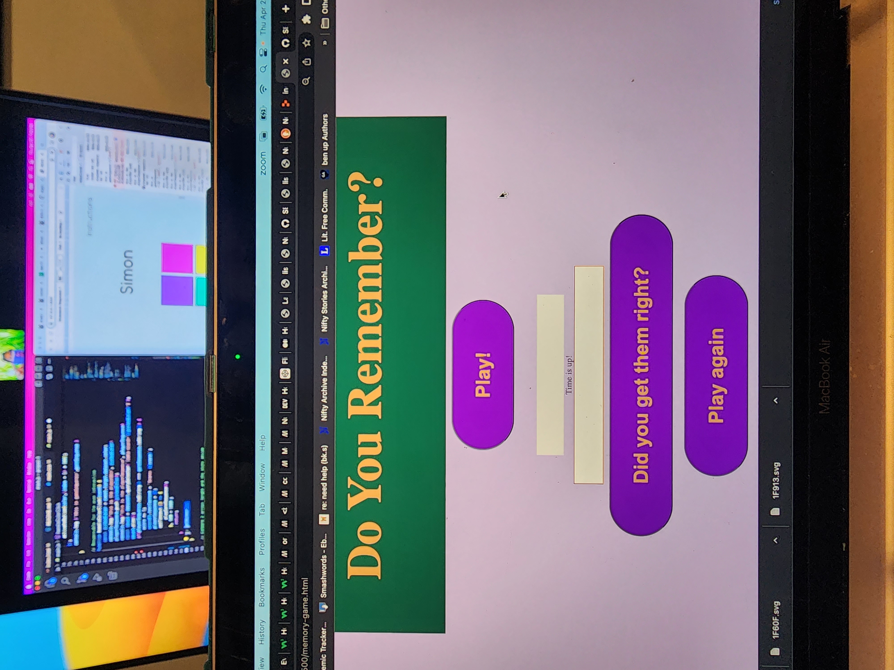

# Menory-Game

Link to game
https://ss-stewart.github.io/Memory-Game/

Wireframe

Screenshot of live game

Numbers Memory Game
  The game allows players to test and build their memory retention, while having fun. The game presents users with a set of five random numbers that they must remember in their order before a displayed timer runs out. At the end of the timer, the cards flips so that the numbers are no longer visible. The user is then prompted to enter the numbers as they recall them and then check to see how accurate they were. The game will then display a message, letting the player know how well they did, along with the option to play again.

User Stories
1. I want to see a visually appealing game that tells me what the game is
2. I want to be be able to start the game, with a click
3. I want to see clear instructions or prompts on how to play
4. I want to see non-repetetive numbers to memorize
5. I want those numbers to become hidden upon some trigger
6. I want to be promted and allowed to enter the numbers I remember
7. I want to be able to see how well I did
8. I want the option to play again

Technologies Used
1. CSS

2. JS
3. HTML

Pseudocode
1. Display game name in header, buttons and instructions as necessary
2. Play Button does triggers these events
  . Use randomInt, generate 5 integers between 0 and 99
    - Display them on a card
  . Launch countown clock/timer 
  . Display game instructions
3. At end of countdown, display message 'Time's up!' and hide the card/numbers
  . Accept user response as input
  . Allow button click to validate player answer
  . Based on win/loss logic, display message to let player know how well they scored
4. Allow player to restart the game
  . use a click event

Cached Variables (constants)
. test 
. cardFront 
. timer 
. instructionMsg
. startButton 
. restartButton 
. checkAnsButton 
. gameNumbers 
. playerInput 

Buttons (hover with cursor- pointer)
  Play!
  Did you get them right? 
  Play Again

Card
  Div that display the random integers
  Hides display on trigger

Functions
  eventListener() - player clicks
  textContent - game generated numbers and event messages
  math.Random(), generateNums() - generate game numbers 
  if/else - validate player response, end of timer, 
  compare, compareNums, 
  startTimer - runs timer in window  
  init - resets and restarts game upon click event

Timer: Display in an element

Messages to render
  Game instructions
  'Better take that ginko!'
  'Time's up!' 
  Win/Loss
    'Think tou got it? Enter the numbers in the correct order' with thinking-emoji
    'I bet you leave your keys in the fridge...'
    'Way to go, Eintein!'

Icebox
  . Add more levels: more numbers to remember and less time on the countdown clock
  . Better visual, eg. animated background
  . Ability to play against others
  . Option to get clues
  . Ability to keep track of wins overtime
  . Ability to share success on social media
